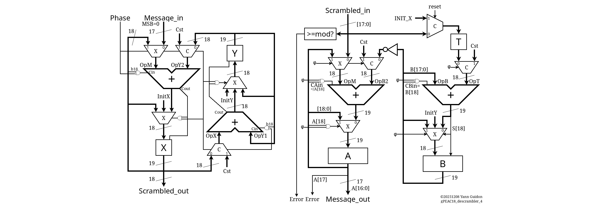

## What is this miniMAC

IMPORTANT: This custom circuit and protocol is not at all compliant or even compatible, even remotely linked to any 802.3 standard. It's all explained and detailed on Hackaday at https://hackaday.io/project/198914

This unit works on 16-bit data, which are scrambled with a 17th bit for data/control framing (C/D). The 18-bit result is suitable for sending to a (custom) PHY (see https://hackaday.io/project/203186 ) for serialisation and line coding. This unit combines two sophisticated circuits:

- The term "gPEAC" means "generalised Pisano with End-Around Carry" (see https://hackaday.io/project/178998 ), a class of PRNG/scrambler/checksum that uses different mathematics than Galois-based LFSR. The gPEAC18 unit is a non-power-of-two additive-based scrambler-checksum, with modulo 258114. It combines the 17 bits and creates an extra check bit.

- "Hammer" is a contraction of the "Hamming distance maximiser". The Hammer18 unit is a XOR-based (bijective) scrambler that boosts the Hamming distance on the 18 bits. This version contains 3 layers of 18-bit permutations between 64 XOR2 gates, its avalanche profile for single-bit toggle is 7 8 8 8 8 9 9 9 9 10 11 13 13 14 14 14 15 16 and the circuit looks like this: 

Together they provide very strong scrambling, eliminate problems inherent with classical LFSRs, and detect errors very early. With an equivalent of 56 bits of state, the system is tailored for early retransmition. A external circuit is required to implement the higher-level protocol, buffering and retransmition logic.

## How it works

The Hammer stage works in one cycle while gPEAC requires two cycles. The latency is 3 cycles, a sequence that is internally started when data is initially input with Den=1. Due to pin constraints, the data are transmitted in two cycles. For decoding, the next stage is Hammer scrambling then 2 stages of gPEAC descrambling, followed by 2 cycles of writing the results over 2 cycles.

Two of the three stages are overlapped and pipelined to provide a throughput of 1 every other clock pulse. The 2 cycles of operand feeding match the 2 cycles of gPEAC.

## How to test

Input a data word on the input, clock and enable, and get encoded or decoded data at the output.

Loopback mode internally connects the encoder pipeline to the decoder pipeline, the output should match the input (with a delay of 9 clock cycles).

## External hardware

Custom boards will be put together. I will try to get a pair of boards to connect together, such that I can verify a whole transmition chain

(to be continued)
